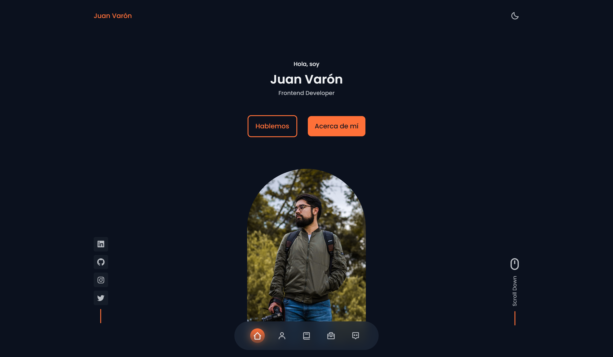

# Juan Varón Front-end Developer Portfolio 😌

## See how it is going [here](https://juandavaron.github.io)!



This is a sample of my work as a front end web developer

## Table of contents

- [My process](#my-process)
  - [Built with](#built-with)
  - [What I learned](#what-i-learned)
  - [Continued development](#continued-development)
  - [Useful resources](#useful-resources)
- [Author](#author)


## My process

### Built with

- ✅Semantic HTML5 markup
- ✅CSS custom properties
- ✅Flexbox
- ✅CSS Grid
- ✅Sass. Prepocessor of CSS
- ✅Mobile-first workflow
- ✅JavaScript
- ✅BEM Methodology
- ✅[MixItUp dependecy](https://www.kunkalabs.com/mixitup/)
- ✅Responsive Desing.
- ✅Smooth scrolling.
- ✅**Dark** and **light** mode.
- 🔒Toggle language between **Spanish** and **English**
---
### What I learned

I started using **BEM** and **Sass** jointly. This not only accelerated the process more but also gave much more order to the code. Also, I was looking and found dependencies that helped me with the animations of some sections and changed the dark theme to the light theme.

```html
<h1 class="section__title"></h1>
```
```scss
.section {
  &__title{
    color: papayawhip;
  }
}
```

---
### Continued development

This project will continue to be updated and I will try to implement Frameworks as React.

---
### Useful resources

- [BEM cheat Sheet](https://9elements.com/bem-cheat-sheet/) - This helped me in the construction of all HTML classes which made me easier for Sass styles. I really liked this pattern and will use it going forward.
- [MixItUp](https://www.kunkalabs.com/mixitup/) - I did not know this dependency but it seems extremely useful for making animations from JavaScript. Fully recommended and will continue to present in my projects.

**Note: Delete this note and replace the list above with resources that helped you during the challenge. These could come in handy for anyone viewing your solution or for yourself when you look back on this project in the future.**

---
## Author

- Linkedin - [Juan David Varón](https://www.linkedin.com/in/juanvarong/)
- Twitter - [@NosoyeseJuan_](https://twitter.com/NosoyeseJuan_)
- Instagram - [@NosoyeseJuan](https://www.instagram.com/nosoyesejuan/)

